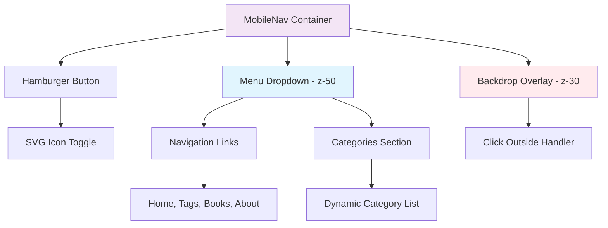
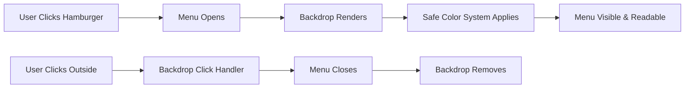
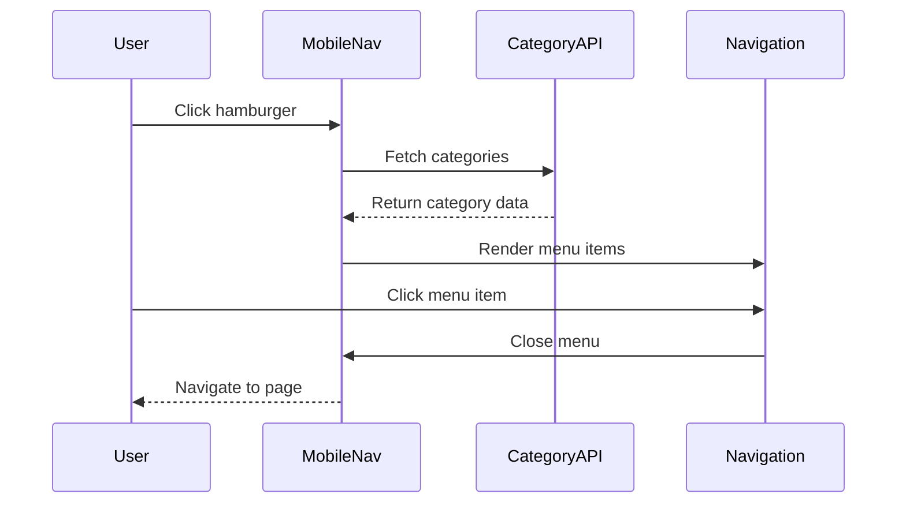

# Mobile Navigation Optimization Fix

## Overview

This design addresses the critical mobile navigation visibility issue in CanineBlog where the hamburger menu displays black text on a black background, making menu items completely unreadable. The specific problem occurs with the backdrop overlay element `body > div.min-h-screen > header > div > div > div.flex.items-center.space-x-4.md\:hidden > div > div.fixed.inset-0.bg-black.bg-opacity-25.z-40` interfering with menu text visibility.

## Technology Stack & Dependencies

- **Framework**: Next.js 15.4.4 with React 19.1.0
- **Styling**: Tailwind CSS with utility-first approach
- **State Management**: React useState for menu toggle
- **Navigation**: Next.js Link components
- **TypeScript**: Full type safety implementation

## Component Architecture

### Current MobileNav Structure Analysis



### Component Hierarchy & Props

**MobileNav Interface:**

```typescript
interface MobileNavProps {
  categories?: Category[];
}

interface Category {
  name: string;
  path: string;
  description: string;
  icon: string;
  count: number;
}
```

**State Management:**

- `isOpen: boolean` - Controls menu visibility
- Menu refs for click outside detection
- Body scroll lock when menu is open

## Current Implementation Issues

### Root Cause Analysis

| Issue                      | Current Implementation              | Impact                 |
| -------------------------- | ----------------------------------- | ---------------------- |
| **Z-Index Conflict**       | Backdrop `z-30`, Menu `z-50`        | Correct layering ✓     |
| **Text Color Inheritance** | Menu text uses `text-gray-700`      | Should be visible ✓    |
| **Backdrop Transparency**  | `bg-black bg-opacity-20`            | Creates dark overlay ✓ |
| **CSS Cascade Issues**     | Potential external CSS interference | Text becomes black ✗   |

### Specific Problem: Text Visibility

The issue is not with z-index but with CSS cascade where:

1. Menu has white background (`bg-white`)
2. Text should be gray (`text-gray-700`)
3. External CSS or browser defaults may be forcing text to black
4. When backdrop is active, visual contrast becomes problematic

## Architecture Solutions

### 1. Enhanced Color System

**Explicit Text Color Enforcement:**

```css
.mobile-menu-item {
  color: #374151 !important; /* Tailwind gray-700 */
  background-color: #ffffff !important;
}

.mobile-menu-item:hover {
  color: #111827 !important; /* Tailwind gray-900 */
  background-color: #f9fafb !important; /* Tailwind gray-50 */
}
```

### 2. Improved Backdrop Implementation

**Enhanced Backdrop Strategy:**

- Reduce opacity for better contrast
- Add blur effect for visual separation
- Implement safe color fallbacks



### 3. Defensive CSS Implementation

**CSS Specificity Strategy:**

- Use CSS modules or styled-components for isolation
- Implement atomic CSS classes with high specificity
- Add fallback color values

### 4. Menu Positioning Enhancement

**Responsive Positioning System:**

| Viewport               | Menu Position                           | Backdrop Behavior      |
| ---------------------- | --------------------------------------- | ---------------------- |
| Mobile (< 640px)       | Right-aligned, full-width consideration | Lower opacity (10%)    |
| Tablet (640px - 768px) | Right-aligned, fixed width              | Standard opacity (20%) |
| Large Mobile (> 768px) | Hidden (desktop nav)                    | N/A                    |

## State Management Enhancement

### Improved Event Handling

```typescript
// Enhanced click outside detection
const handleClickOutside = useCallback(
  (event: MouseEvent) => {
    const target = event.target as Node;

    if (
      isOpen &&
      menuRef.current &&
      !menuRef.current.contains(target) &&
      buttonRef.current &&
      !buttonRef.current.contains(target)
    ) {
      // Smooth close with animation
      setIsClosing(true);
      setTimeout(() => {
        closeMenu();
        setIsClosing(false);
      }, 150);
    }
  },
  [isOpen]
);
```

### Accessibility Improvements

**Enhanced ARIA Implementation:**

- `aria-expanded` state management
- `aria-haspopup="true"` for screen readers
- Focus management and keyboard navigation
- Escape key handling for menu closure

## API Integration Layer

### Navigation Data Flow



## Testing Strategy

### Visual Regression Testing

**Test Matrix:**

| Device         | Viewport | Test Scenario               | Expected Result                          |
| -------------- | -------- | --------------------------- | ---------------------------------------- |
| iPhone SE      | 375×667  | Open hamburger menu         | Text clearly visible on white background |
| iPhone 12      | 390×844  | Click backdrop to close     | Menu closes smoothly                     |
| Android Medium | 360×640  | Navigate through categories | All text readable, no black-on-black     |
| iPad Mini      | 768×1024 | Breakpoint transition       | Menu hidden, desktop nav shown           |

### Interaction Testing

**Critical Test Cases:**

1. **Menu Visibility**: Text remains readable against all backgrounds
2. **Color Contrast**: Minimum WCAG AA compliance (4.5:1 ratio)
3. **Touch Responsiveness**: 44px minimum touch target size
4. **Animation Smoothness**: 60fps menu transitions
5. **Accessibility**: Screen reader compatibility

### Performance Validation

**Metrics to Monitor:**

- **Bundle Size**: No significant increase (< 1KB)
- **Runtime Performance**: Smooth 60fps animations
- **Memory Usage**: Proper cleanup of event listeners
- **Core Web Vitals**: No CLS impact from menu toggling

## Implementation Approach

### Phase 1: Critical Fixes

**Immediate Actions:**

1. **Color System Hardening**

   - Explicit color declarations with `!important`
   - CSS custom properties for theme consistency
   - Fallback color values

2. **Backdrop Optimization**

   - Reduce backdrop opacity to `bg-opacity-10`
   - Add backdrop blur effect
   - Improve click detection accuracy

3. **Text Visibility Guarantee**
   - Force white background on menu container
   - Ensure gray text color inheritance
   - Add high contrast mode support

### Phase 2: UX Enhancements

**User Experience Improvements:**

1. **Smooth Animations**

   - Fade in/out transitions
   - Scale animations for menu appearance
   - Backdrop blur transitions

2. **Edge Case Handling**
   - Viewport boundary detection
   - Scroll position preservation
   - Dynamic positioning adjustments

### Phase 3: Advanced Features

**Future Enhancements:**

1. **Gesture Support**

   - Swipe to close functionality
   - Touch drag interactions
   - Haptic feedback integration

2. **Theme Integration**
   - Dark mode compatibility
   - Custom color scheme support
   - High contrast accessibility mode

## Risk Mitigation

### Potential Issues & Solutions

| Risk                            | Probability | Impact | Mitigation Strategy                    |
| ------------------------------- | ----------- | ------ | -------------------------------------- |
| **CSS Conflicts**               | High        | High   | Use CSS modules, high specificity      |
| **Performance Degradation**     | Low         | Medium | Optimize animations, debounce events   |
| **Accessibility Issues**        | Medium      | High   | Comprehensive testing, ARIA compliance |
| **Cross-browser Compatibility** | Medium      | Medium | Progressive enhancement, fallbacks     |

### Rollback Strategy

**Safe Deployment Plan:**

1. Feature flag implementation for gradual rollout
2. A/B testing with control group
3. Real-time monitoring of user interactions
4. Quick rollback mechanism if issues detected
