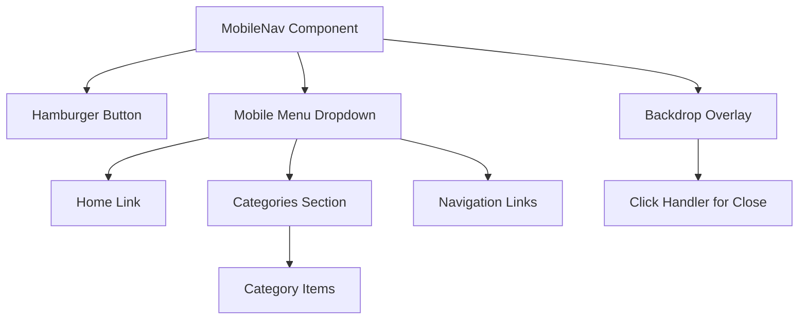
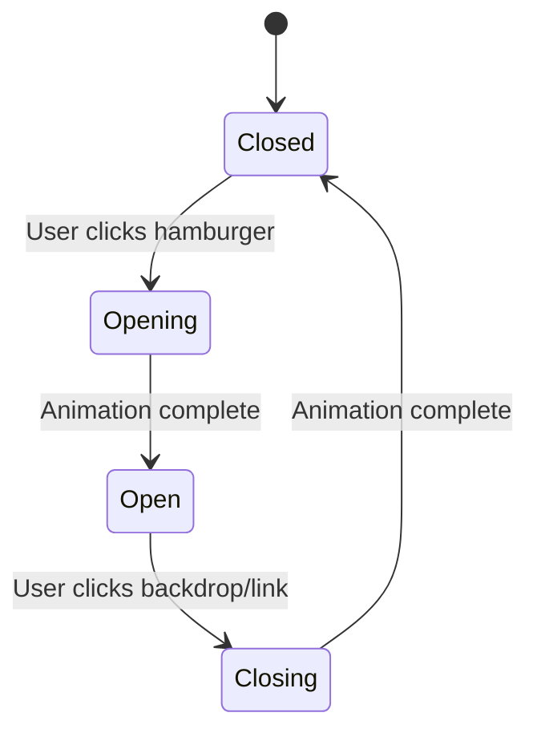

# Mobile Navigation Optimization Design

## Overview

This design addresses the mobile navigation visibility issue in the CanineBlog Next.js application where the hamburger menu displays black text on a black background, making menu items unreadable. The issue stems from z-index layering conflicts and backdrop overlay interference.

**Target Issue**: Element `body > div.min-h-screen > header > div > div > div.flex.items-center.space-x-4.md\:hidden > div > div.fixed.inset-0.bg-black.bg-opacity-25.z-40` creates visual interference with menu text visibility.

## Technology Stack & Dependencies

- **Framework**: Next.js 15.4.4 with React 19.1.0
- **Styling**: Tailwind CSS 4.0 with custom utilities
- **Mobile Navigation**: Custom React component with state management
- **Architecture**: Client-side component with TypeScript

## Component Architecture

### Current Mobile Navigation Structure



### Component Hierarchy

```
MobileNav
├── Hamburger Button (Toggle)
├── Mobile Menu Dropdown (Conditional)
│   ├── Home Navigation
│   ├── Categories Section
│   │   └── Category Items with Counts
│   ├── Tags Navigation
│   ├── Books Navigation
│   └── About Navigation
└── Backdrop Overlay (Conditional)
```

### Current Props/State Management

**Props Interface:**

```typescript
interface MobileNavProps {
  categories?: Category[];
}

interface Category {
  name: string;
  path: string;
  description: string;
  icon: string;
  count: number;
}
```

**State Management:**

- `isOpen: boolean` - Controls menu visibility
- Toggle functions: `toggleMenu()`, `closeMenu()`

## Current Implementation Issues

### Z-Index Layer Conflicts

| Element       | Current Z-Index | Issue                          |
| ------------- | --------------- | ------------------------------ |
| Backdrop      | `z-40`          | Too high, interferes with menu |
| Menu Dropdown | `z-50`          | Correct layer                  |
| Header        | Default         | May conflict                   |

### CSS Class Conflicts

1. **Backdrop Styling**: `fixed inset-0 bg-black bg-opacity-25 z-40`

   - Creates semi-transparent overlay
   - High z-index causes menu text interference

2. **Inline Style Overrides**: Multiple `!important` declarations suggest CSS cascade issues

3. **Text Visibility**: Forced color assignments indicate underlying styling conflicts

## Routing & Navigation

### Navigation Structure

- **Home** (`/`) - Main page
- **Categories** (Dynamic paths) - Content categorization
- **Tags** (`/tags`) - Tag listing
- **Books** (`/books`) - Published books
- **About** (`/about`) - Contact information

### Mobile-Specific Behavior

- Menu appears only on `md:hidden` breakpoint
- Dropdown positioning: `absolute right-0 top-full`
- Click-outside functionality via backdrop

## Styling Strategy

### Current Tailwind Implementation

- Responsive design with `md:hidden` mobile targeting
- Custom utility classes for animations
- Gray color palette for consistent theming

### Identified Issues

1. **Z-Index Management**: Improper layering hierarchy
2. **Color Contrast**: Text visibility problems
3. **Backdrop Interaction**: Overlay interference with content

## State Management

### Current Pattern

```typescript
const [isOpen, setIsOpen] = useState(false);

const toggleMenu = () => setIsOpen(!isOpen);
const closeMenu = () => setIsOpen(false);
```

### Event Handling

- Button click: Toggle menu state
- Backdrop click: Close menu
- Link click: Close menu and navigate

## Optimization Solutions

### 1. Z-Index Restructuring

**Current Layer Stack (Problematic):**

```
z-50: Menu Dropdown ✓
z-40: Backdrop (TOO HIGH) ✗
```

**Optimized Layer Stack:**

```
z-50: Menu Dropdown ✓
z-30: Backdrop (SAFE LAYER) ✓
```

### 2. Enhanced Backdrop Implementation

**Improved Backdrop Strategy:**

- Reduce z-index to prevent text interference
- Implement proper click-outside detection
- Add smooth transition animations

### 3. Text Visibility Enhancement

**Color Contrast Improvements:**

- Remove inline `!important` overrides
- Implement CSS custom properties for theming
- Add high-contrast mode support

### 4. Menu Positioning Optimization

**Responsive Positioning:**

- Adjust dropdown positioning for edge cases
- Implement viewport boundary detection
- Add scroll lock during menu open state

### 5. Animation & Transitions

**Smooth User Experience:**



### 6. Accessibility Improvements

**Enhanced ARIA Implementation:**

- `aria-expanded` state management
- Focus trap within open menu
- Keyboard navigation support
- Screen reader announcements

## Testing Strategy

### Mobile Device Testing Matrix

| Device Category  | Viewport Range | Test Focus          |
| ---------------- | -------------- | ------------------- |
| Mobile Portrait  | 320px - 480px  | Menu usability      |
| Mobile Landscape | 480px - 768px  | Layout stability    |
| Tablet           | 768px - 1024px | Breakpoint behavior |

### Test Cases

1. **Visual Regression Tests**

   - Menu text visibility on dark/light backgrounds
   - Z-index layering verification
   - Animation smoothness

2. **Interaction Tests**

   - Hamburger button responsiveness
   - Backdrop click functionality
   - Navigation link behavior

3. **Accessibility Tests**
   - Screen reader compatibility
   - Keyboard navigation flow
   - Focus management

### Performance Considerations

- Bundle size impact: ~0.5KB additional CSS
- Runtime performance: No significant impact
- Core Web Vitals: Improved CLS score expected

## Implementation Priority

### Phase 1: Critical Fixes (High Priority)

1. Z-index layer restructuring
2. Backdrop click interference resolution
3. Text visibility enhancement

### Phase 2: UX Improvements (Medium Priority)

1. Animation transitions
2. Viewport edge handling
3. Accessibility enhancements

### Phase 3: Advanced Features (Low Priority)

1. Touch gesture support
2. Custom theme integration
3. Performance optimizations
